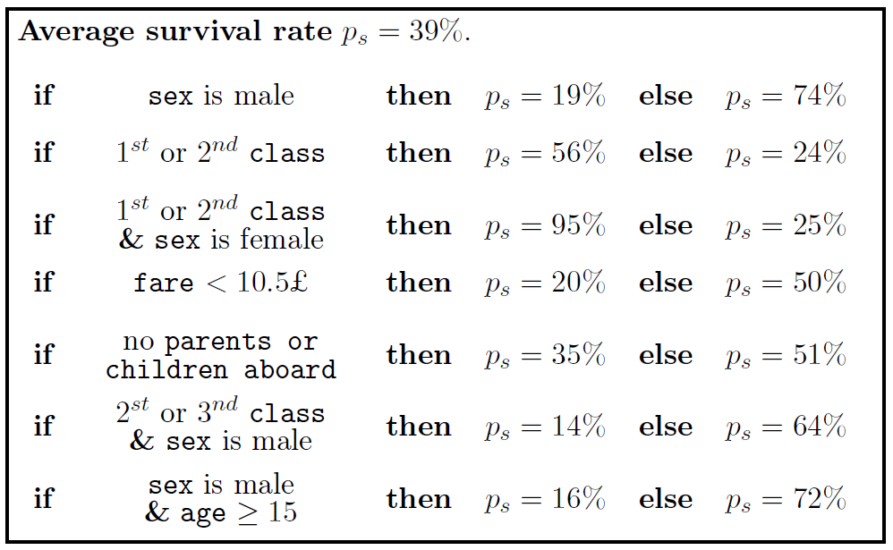

## SIRUS: Stable and Interpretable RUle Set
C. Benard (Safran Tech & Sorbonne University)

### Introduction
SIRUS (Stable and Interpretable RUle Set) is a regression and classification algorithm based on random forests, which takes the form of a short list of rules. 
SIRUS combines the simplicity of decision trees with the predictivity of random forests. 
More importantly, the rule selection is stable with respect to data perturbation.
The core aggregation principle of random forests is kept, but instead of aggregating predictions, SIRUS selects the most frequent nodes of the forest to form a stable rule ensemble model.
SIRUS for classification is defined in (Benard et al. 2021), and the extension to regression is provided in (Benard et al. 2020).
This R package is a fork from the  project ranger (https://github.com/imbs-hl/ranger).

Example of SIRUS with the Titanic dataset, where `ps` is the survival probability:

 

### Installation
To install sirus, download sirus_0.3.2.tar.gz and just run:
	install.packages("sirus_0.3.2.tar.gz", repos = NULL)

R version >= 3.1 is required. If you compile yourself, the new RTools toolchain is required.

Pre-compiled binaries are available for windows (sirus_0.3.2.zip) and linux (sirus_0.3.2_R_x86_64-pc-linux-gnu.tar.gz).

### Usage
For usage of the package see the Examples section. 

If you find any bug, or have any suggestions for improvement, please let us know !

### References
* Benard, C., Biau, G., Da Veiga, S. & Scornet, E. (2021). SIRUS: Stable and Interpretable RUle Set for classification. Electronic Journal of Statistics, 15:427-505.
* Benard, C., Biau, G., Da Veiga, S. & Scornet, E. (2020). Interpretable Random Forests via Rule Extraction. arXiv preprint arXiv:2004.14841. https://arxiv.org/abs/2004.14841.
* Breiman, L. (2001). Random forests. Mach Learn, 45:5-32. https://doi.org/10.1023/A:1010933404324
* Wright, M. N. & Ziegler, A. (2017). ranger: A fast implementation of random forests for high dimensional data in C++ and R. J Stat Softw 77:1-17. https://doi.org/10.18637/jss.v077.i01

